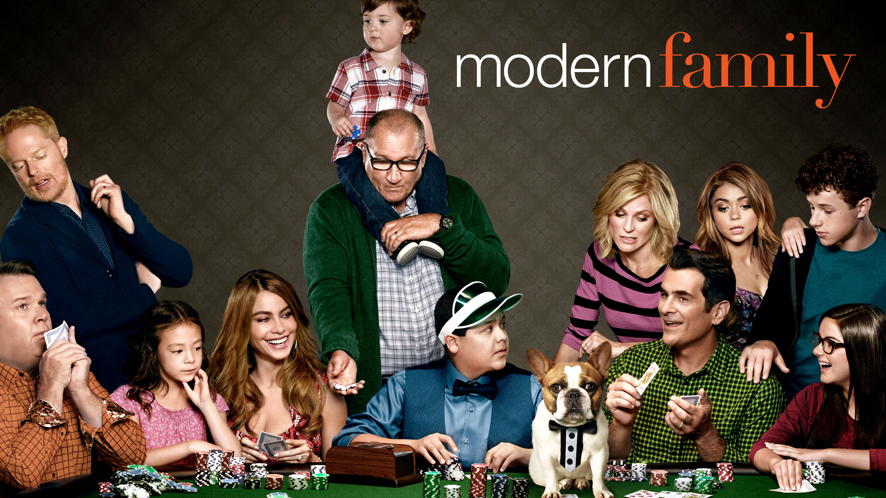
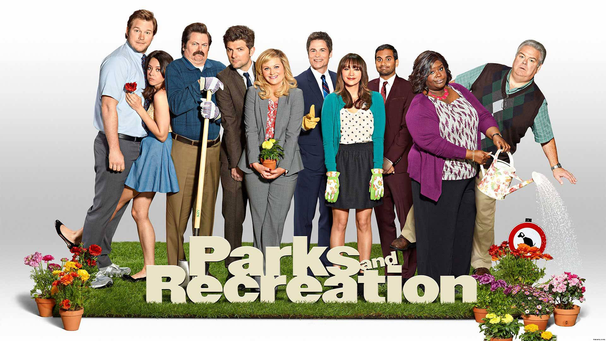
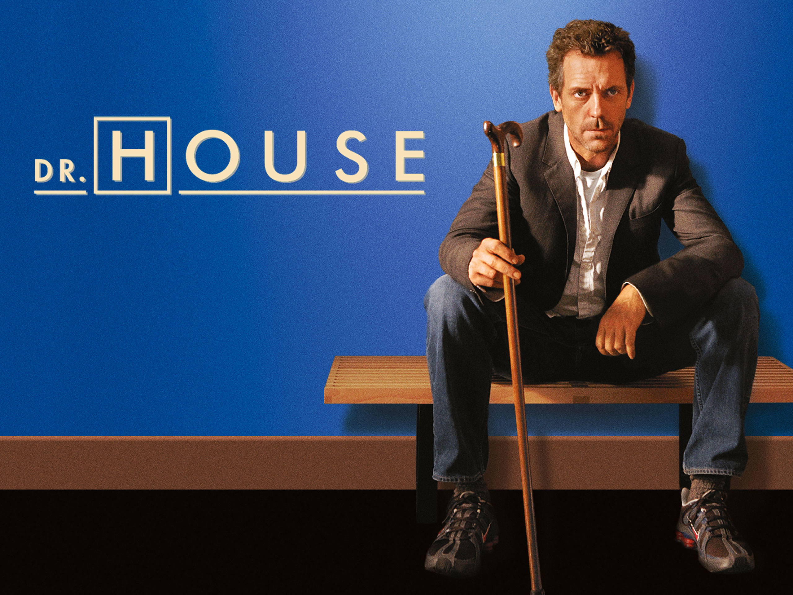
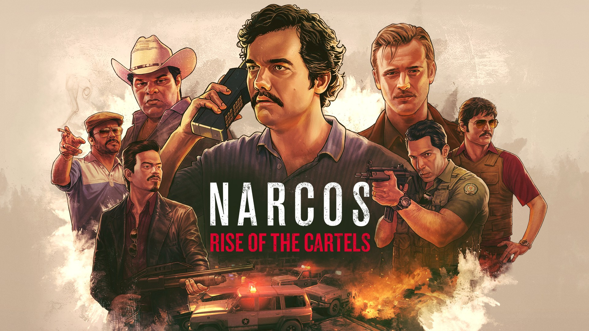
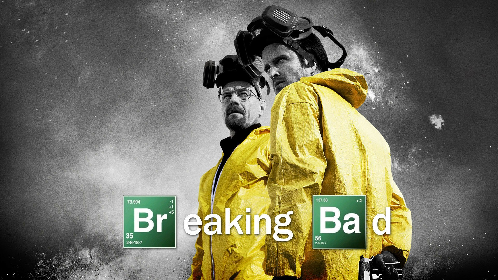
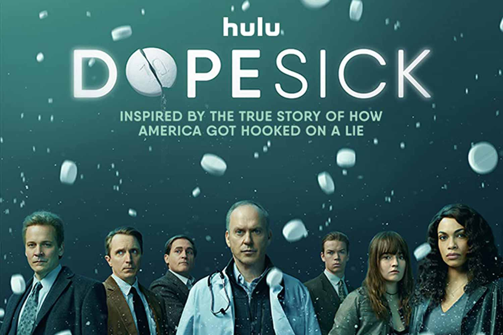
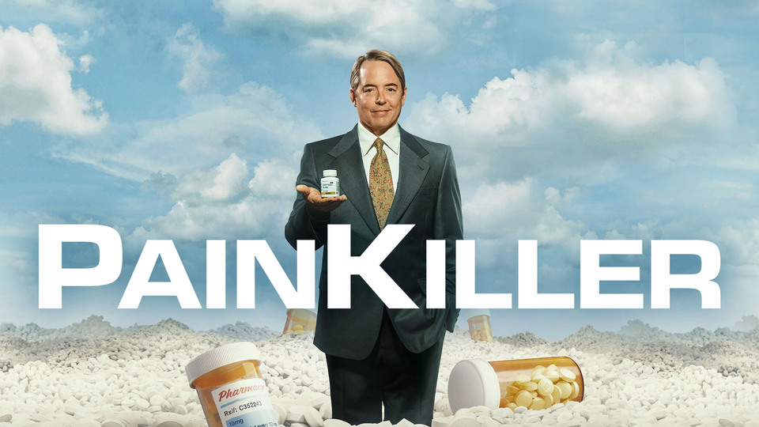
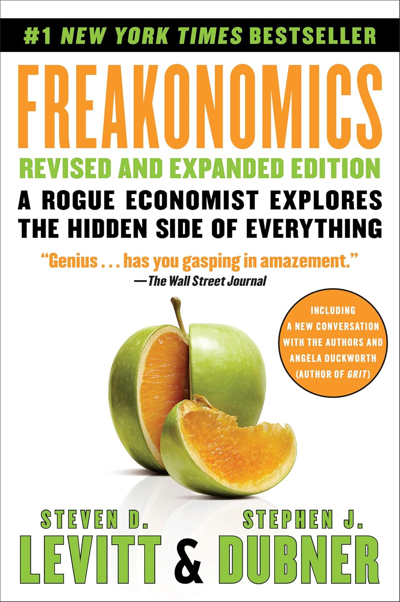
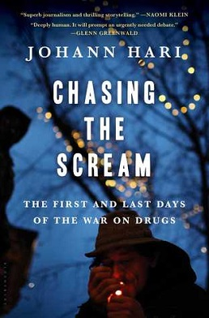

::: {.about-hero}
::: {.about-image}

:::

::: {.about-copy}
I am an economist and data scientist with broad interests in risky behavior, especially in the areas of health and crime. I study how access, policy, and institutions shape outcomes in substance use, treatment, and public programs.

I am especially interested in questions that speak to how public resources can be used more effectively and how evidence can be communicated clearly and responsibly.

Some of the questions I have asked and am working on answering:

- (How) does deterrence in illicit opioid markets work?
- How effective are large scale investments in substance use treatment? How can they be better?
- How much do barriers to accessing alcohol matter for the health of babies?
- Do average golfers receive peer effects when playing with their scratch golfer friend?

[Follow me on Goodreads](https://goodreads.com/studhall){.home-inline-link}
:::
:::

For a little more about me, here are some of my hobbies and media I have enjoyed consuming.

## Hobbies

Golf, Pokemon, and cooking.

## Favorite Shows

::: {#favorite-shows .carousel .slide .media-carousel data-bs-ride="carousel" data-bs-interval="3600"}
::: {.carousel-inner}
::: {.carousel-item .active}
::: {.carousel-card}

<h3>How I Met Your Mother</h3>
:::
:::
::: {.carousel-item}
::: {.carousel-card}

<h3>Naruto Shippuden</h3>
:::
:::
::: {.carousel-item}
::: {.carousel-card}

<h3>Avatar: The Last Airbender</h3>
:::
:::
::: {.carousel-item}
::: {.carousel-card}

<h3>Money Heist</h3>
:::
:::
::: {.carousel-item}
::: {.carousel-card}

<h3>Modern Family</h3>
:::
:::
::: {.carousel-item}
::: {.carousel-card}

<h3>Parks and Rec</h3>
:::
:::
::: {.carousel-item}
::: {.carousel-card}

<h3>Ted Lasso</h3>
:::
:::
::: {.carousel-item}
::: {.carousel-card}

<h3>House</h3>
:::
:::
:::
<button class="carousel-control-prev" type="button" data-bs-target="#favorite-shows" data-bs-slide="prev">Previous</button>
<button class="carousel-control-next" type="button" data-bs-target="#favorite-shows" data-bs-slide="next">Next</button>
:::

## Substance Use And Drug-Related Shows

::: {#drug-shows .carousel .slide .media-carousel data-bs-ride="carousel" data-bs-interval="3900"}
::: {.carousel-inner}
::: {.carousel-item .active}
::: {.carousel-card}

<h3>Narcos</h3>
:::
:::
::: {.carousel-item}
::: {.carousel-card}

<h3>Breaking Bad</h3>
:::
:::
::: {.carousel-item}
::: {.carousel-card}

<h3>Dopesick</h3>
:::
:::
::: {.carousel-item}
::: {.carousel-card}

<h3>Painkiller</h3>
:::
:::
:::
<button class="carousel-control-prev" type="button" data-bs-target="#drug-shows" data-bs-slide="prev">Previous</button>
<button class="carousel-control-next" type="button" data-bs-target="#drug-shows" data-bs-slide="next">Next</button>
:::

## Favorite Book Series

::: {#book-series .carousel .slide .media-carousel data-bs-ride="carousel" data-bs-interval="4200"}
::: {.carousel-inner}
::: {.carousel-item .active}
::: {.carousel-card}

<h3>Cradle</h3>
:::
:::
::: {.carousel-item}
::: {.carousel-card}

<h3>Dungeon Crawler Carl</h3>
:::
:::
::: {.carousel-item}
::: {.carousel-card}

<h3>Hunger Games</h3>
:::
:::
::: {.carousel-item}
::: {.carousel-card}

<h3>Star Wars High Republic</h3>
:::
:::
:::
<button class="carousel-control-prev" type="button" data-bs-target="#book-series" data-bs-slide="prev">Previous</button>
<button class="carousel-control-next" type="button" data-bs-target="#book-series" data-bs-slide="next">Next</button>
:::

## Books On Drugs And Policy

::: {#drug-books .carousel .slide .media-carousel data-bs-ride="carousel" data-bs-interval="4500"}
::: {.carousel-inner}
::: {.carousel-item .active}
::: {.carousel-card}

<h3>Empire of Pain</h3>
:::
:::
::: {.carousel-item}
::: {.carousel-card}

<h3>Fentanyl Inc.</h3>
:::
:::
::: {.carousel-item}
::: {.carousel-card}

<h3>Freakonomics</h3>
:::
:::
::: {.carousel-item}
::: {.carousel-card}

<h3>Chasing the Scream</h3>
:::
:::
:::
<button class="carousel-control-prev" type="button" data-bs-target="#drug-books" data-bs-slide="prev">Previous</button>
<button class="carousel-control-next" type="button" data-bs-target="#drug-books" data-bs-slide="next">Next</button>
:::

