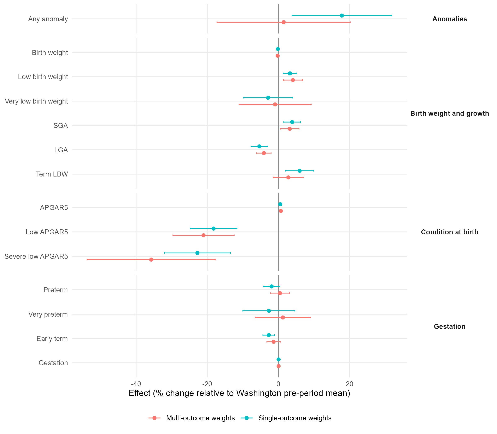

---
format:
  html:
    toc: false
    anchor-sections: false
    title-block: false
    title-block-banner: false
---

::: {.home-hero}
::: {.site-hero-text}

David Hall

I am an applied microeconomist and data scientist studying health, risky behavior, and public policy. My research examines how market access and public institutions shape substance use, treatment, and health outcomes. I also serve on Oregon's [Behavioral Health Resource Network Oversight and Accountability Council](https://www.oregon.gov/oha/HSD/AMH/Pages/OAC.aspx).

[Curriculum vitae](cv.qmd){.home-inline-link}
:::

::: {.site-hero-image}

<a class="home-inline-link" href="https://www.linkedin.com/in/david-hall-58a5b6125/" target="_blank" rel="noopener">LinkedIn</a>
<a class="home-inline-link" href="mailto:dhall7@uoregon.edu">Email</a>

:::
:::

::: {.job-market-panel}

2026-2027 Job Market

## Pour Decisions: Alcohol Privatization and Birth Outcomes

Washington's Initiative 1183 substantially expanded spirits access through grocery and big-box stores. I study how that change affected birth outcomes and what the results imply for alcohol-tax design aimed at limiting health harms.

Working paper · Available upon request

{.job-market-figure}

<strong>Abstract.</strong> Washington's Initiative 1183 privatized spirits retail in June 2012. Using Nielsen Homescan data, restricted-use natality records, and repeated-cross-section synthetic difference-in-differences, I estimate that privatization increased projected household spirits purchases by 35 percent, reduced average birth weight, and increased low-birth-weight and small-for-gestational-age births. Distributional estimates place the response around clinically meaningful lower birth-weight bins.

:::
