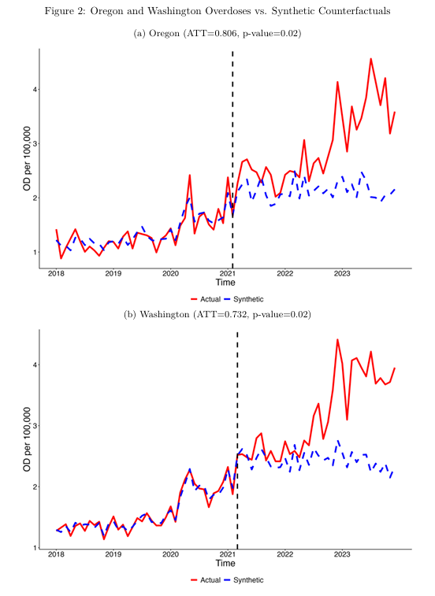
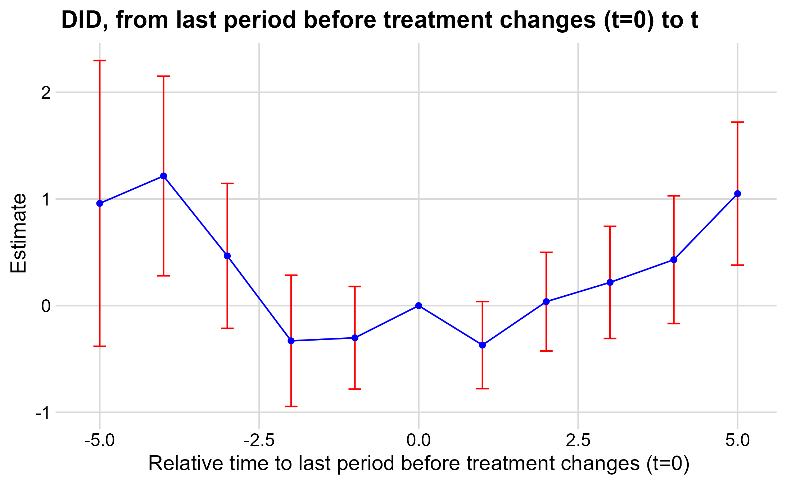
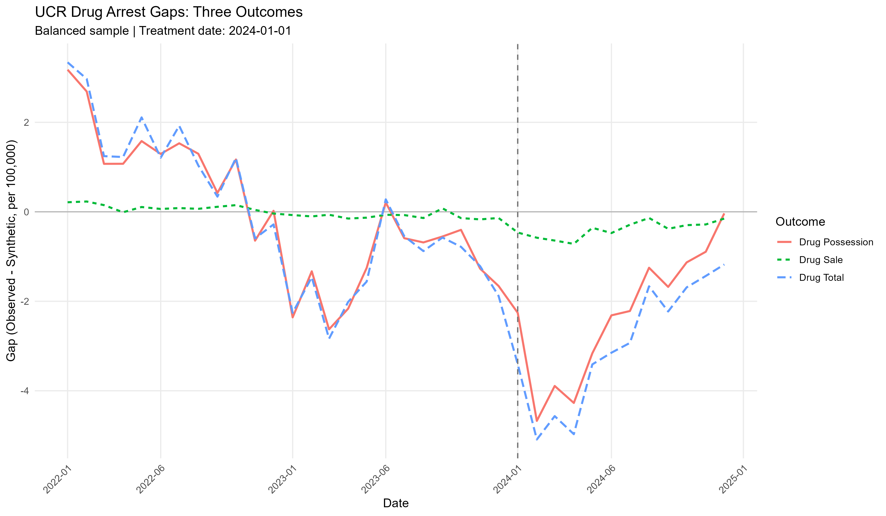

## Working Papers

::: {.research-row}
::: {.research-copy}
### [Pour Decisions: Alcohol Privatization and Birth Outcomes](papers/Hall_JMP_v1.pdf){target="_blank"}

**Job Market Paper** · [PDF](papers/Hall_JMP_v1.pdf){target="_blank"}

Alcohol-market liberalization can change prices, retail availability, convenience, and product choice simultaneously. Increased alcohol use can generate substantial social and health costs, particularly when exposure occurs during pregnancy. Does a broad market reform that expands access to alcohol lead to poorer birth outcomes? I study Washington's Initiative 1183, which privatized spirits retailing in June 2012 and expanded entry by grocery and big-box stores. I find that privatization substantially increased very local spirits access, bringing a larger share of the population within one mile of a spirits retailer. NielsenIQ Homescan data also show a 35% increase in recorded household spirits purchases after privatization. Substitution across beer, wine, and spirits, however, reduces the corresponding increase in total ethanol-equivalent purchasing to 9.2%, and the available household evidence suggests that much of the purchasing response occurred outside prime childbearing ages. Using restricted-use vital statistics and a repeated-cross-section synthetic difference-in-differences design, I find adverse point estimates for birth weight and fetal growth, but these estimates are not unusually large relative to fully refitted placebo-state estimates. I also find no large, coherent shift in the observed birth pool. The results show that the consequences of market liberalization depend not only on whether consumers respond, but on which dimensions of access change, substitution across products, and the incidence of the resulting behavioral response.

:::

::: {.research-figure}

:::
:::

<h3>Did Decriminalization Increase Overdoses?</h3>

David Hall, with Ben Hansen and Kyutaro Matsuzawa

<a href="https://www.nber.org/papers/w35427">NBER Working Paper No. 35427</a> · <a href="https://doi.org/10.3386/w35427">DOI</a> · <a href="https://ssrn.com/abstract=7063369">SSRN</a>

We study drug decriminalization using Oregon's Measure 110 and Washington's <em>Blake</em> decision. Synthetic-control estimates show that both policies sharply reduced drug arrests and were followed by sustained increases in overdose mortality relative to matched counterfactuals. The estimates imply approximately 1,186 excess deaths in Oregon and 1,895 in Washington from 2021 through 2023. Alternative measures of fentanyl supply continue to yield positive overdose effects.

<blockquote class="twitter-tweet">
1/ Did drug decriminalization increase overdose mortality? <a href="https://t.co/3lKxpHZrEM">https://t.co/3lKxpHZrEM</a>  Our (<a href="https://x.com/benconomics?ref_src=twsrc%5Etfw">@benconomics</a> and <a href="https://x.com/q_econ?ref_src=twsrc%5Etfw">@q_econ</a>) NBER working paper studies two 2021 policy changes: Oregon&#39;s Measure 110 and Washington&#39;s Blake Decision.   Thanks to <a href="https://x.com/Arnold_Ventures?ref_src=twsrc%5Etfw">@Arnold_Ventures</a> for your support!
&mdash; David M. Hall (@studhall) <a href="https://x.com/studhall/status/2074338929327927711?ref_src=twsrc%5Etfw">July 7, 2026</a></blockquote>

::: {.research-row}
::: {.research-copy}
### [Does Substance Use Treatment Still Reduce Mortality?](papers/Hall_Treatment_Mortality.pdf){target="_blank"}

**Working paper** · [PDF](papers/Hall_Treatment_Mortality.pdf){target="_blank"}

This paper asks whether expanded substance use disorder treatment access continued to reduce overdose mortality as the opioid epidemic shifted toward fentanyl and polysubstance use. I combine county-level treatment-center measures with National Vital Statistics System mortality data from 1999 through 2022, replicate estimates from the early epidemic, and apply methods suited to heterogeneous, non-binary treatment. The protective relationship found in earlier years weakens over time, highlighting the difficulty of measuring treatment access as treatment capacity and the drug supply evolve simultaneously.

:::
::: {.research-figure}

:::
:::

::: {.research-row .figure-left}
::: {.research-copy}
### The Deterrence Impacts of Fentanyl Supply Laws

**Working paper** · Available upon request

This paper studies California Assembly Bill 701, which extended drug-weight sentencing enhancements to fentanyl and increased penalties above one kilogram. State-level synthetic-control estimates provide little evidence that the law reduced aggregate drug activity. Incident-level estimates show a shift away from quantities above the threshold and toward lower-weight incidents, with no meaningful effect on overdose mortality.

:::
::: {.research-figure}

:::
:::

## Work in Progress

- Treatment Center Ownership and Market Learning
- Did Retail Availability of Naloxone Affect Elasticity?
- Public Provision and Crowding Out: The Case of Naloxone
- A Regime-Switching Model of the Opioid Epidemic
- Impacts of Measure 110's Treatment Funding
- Optimal Sin Tax in General Equilibrium, with Dirghayu Shah
